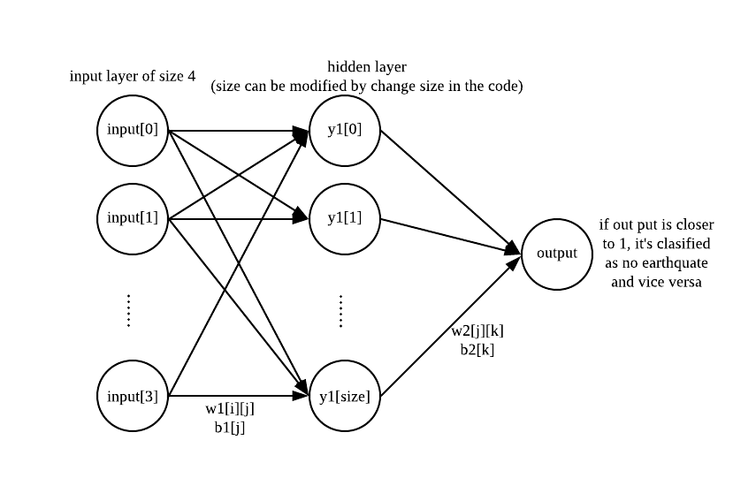

<p style="text-align: center;">Jiapeng Zhang NetID: jz704</p>

<p style="text-align: center;">Lemin Wu NetID: lw514</p>


In this project, we are given earthquake data in area near Shanghai from 1977 to 2008. Different column means different data for different kinds of earthqaukes. Each magnitude is the average magitude within that two-week period.

We firstly try to train a linear model to predict average magnitude four weeks later after.
If the predictd value is larger than 3.0 cut off, we think earthquake did *happended* during that time. 

# Linear Model
```{r}
data<-read.csv("shanghai26.csv", header=TRUE)
data<-data[,-1]
rownum<-nrow(data)
x1<-data[[2]][1:(rownum-2)]
x2<-data[[2]][2:(rownum-1)]
x3<-data[[2]][3:rownum]
y1<-data[[3]][1:(rownum-2)]
y2<-data[[3]][2:(rownum-1)]
y3<-data[[3]][3:rownum]
zmat0<-cbind( x1, x2, y1, y2 , y3)
zmat0<-as.data.frame(zmat0)
zm1=zmat0[1:533,]
zm2=zmat0[401:(rownum-2), ]
fit_linear<-lm(y3~. , data=zm1 )
summary(fit_linear)
```

Based on the summary, we can see the fit is very bad. So the real magnitude values are very nonlinear. But we can still get some results if we close our eyes in linear model...
```{r}
value_linear<-predict(fit_linear, newdata = zm2)
I1=1*(value_linear>3)
plot(I1, 1*(zm2[[5]]>3))
table(unname(I1), 1*(zm2[[5]]>3)  )
```
Ironically, the linear model gives all 1's. I.e., it says earthquakes happen at once every two weeks, not true! 

# Neural Networks
We are going to use nnet to nnet, which is a one-hidden-layner nerual net with logistic output. Loss function is L2 loss, backpropagation formulas are as follows:
$$
\omega_{j,k}(t+1)=\omega_{j, k}(t)-\alpha \Delta_k \, out_j
$$
where $\Delta_k=(out_k - y_k) g'(in_k)$
$$
\omega_{i,j}(t+1)=\omega_{i, j}(t)-\alpha \Delta_j out_j
$$
where $\omega_{i, j}(t+1)=\omega_{i,j}(t)-\alpha \Delta_j \, out_i$


\
For first magnitude:
```{r}
library(nnet)
p3.data<-read.csv("shanghai26.csv", header = FALSE)[-1,-1] 
p3.data<-p3.data[2:5]
p3.data<-apply(p3.data,1:2, as.numeric)

data.mag1<-p3.data[1:832,1]
v1<-data.mag1[1:600]
v2<-data.mag1[2:601]
v3<-data.mag1[3:602]
v4<-data.mag1[4:603]
train.input<-data.frame(cbind(v1,v2,v3,v4))
#names(train.input)<-c('X1','X2','X3','X4')

tar<-data.mag1[5:604]
tar<-tar>3
tar<-1*tar
train.target<-data.frame(tar)
#names(train.target)<-c('Y')

dat.in<-data.frame(train.target,train.input)

mod1<-nnet(train.input,train.target,data=dat.in,size=100, maxit = 2000,linout = F)
val1<-data.mag1[605:828]
val2<-data.mag1[606:829]
val3<-data.mag1[607:830]
val4<-data.mag1[608:831]
val.input<-data.frame(cbind(val1,val2,val3,val4))
p<-predict(mod1,val.input)

p<-p>=0.5
p<-1*p
#sum(p)

val.target<-data.mag1[609:832]
val.target<-val.target>3
val.target<-data.frame(1*val.target)
#sum(val.target)

r1<-p*val.target
r2<-(1-p)*(1-val.target)
r3<-p*(1-val.target)
r4<-(1-p)*(val.target)
#sum(r1) # 
#sum(r2)
#sum(r3)
#sum(r4)
table(p, data.mag1[609:832]>3)
sprintf("accuracy=%f", sum(p=(1* (data.mag1[609:832]) >3) ) / length(p) ) 
```
Then, the second magnitude:
```{r}
#p3.data<-read.csv("shanghai26.csv", header = FALSE)[-1,-1] 
#p3.data<-p3.data[2:5]
#p3.data<-apply(p3.data,1:2, as.numeric)

#data.mag1<-p3.data[1:832,1]
data.mag1<-data[[3]]
v1<-data.mag1[1:600]
v2<-data.mag1[2:601]
v3<-data.mag1[3:602]
v4<-data.mag1[4:603]
train.input<-data.frame(cbind(v1,v2,v3,v4))
#names(train.input)<-c('X1','X2','X3','X4')

tar<-data.mag1[5:604]
tar<-tar>3
tar<-1*tar
train.target<-data.frame(tar)
#names(train.target)<-c('Y')

dat.in<-data.frame(train.target,train.input)

mod1<-nnet(train.input,train.target,data=dat.in,size=100, maxit = 2000,linout = F)

val1<-data.mag1[605:828]
val2<-data.mag1[606:829]
val3<-data.mag1[607:830]
val4<-data.mag1[608:831]
val.input<-data.frame(cbind(val1,val2,val3,val4))
p<-predict(mod1,val.input)

p<-p>=0.5
p<-1*p
#sum(p)

val.target<-data.mag1[609:832]
val.target<-val.target>3
val.target<-data.frame(1*val.target)
#sum(val.target)

r1<-p*val.target
r2<-(1-p)*(1-val.target)
r3<-p*(1-val.target)
r4<-(1-p)*(val.target)
#sum(r1) # 
#sum(r2)
#sum(r3)
#sum(r4)
table(p, data.mag1[609:832]>3)
sprintf("accuracy=%f", sum(p=(1* (data.mag1[609:832]) >3) ) / length(p) ) 
```

The first is little better than random guessing, while the second is even slightly worse.

# KNN

For first magnitude:
```{r}
library(kknn)
library(class)
library(sampling)

p3.data<-read.csv("shanghai26.csv", header = FALSE)[-1,-1] #choose shanghai26.csv

p3.data<-p3.data[2:5]
p3.data<-apply(p3.data,1:2, as.numeric)

data.mag1<-p3.data[1:832,1]
v1<-data.mag1[1:600]
v2<-data.mag1[2:601]
v3<-data.mag1[3:602]
v4<-data.mag1[4:603]
train.input<-cbind(v1,v2,v3,v4)
#names(train.input)<-c('X1','X2','X3','X4')

tar<-data.mag1[5:604]
tar<-tar>3
tar<-1*tar
train.target<-tar
#names(train.target)<-c('Y')

val1<-data.mag1[605:828]
val2<-data.mag1[606:829]
val3<-data.mag1[607:830]
val4<-data.mag1[608:831]
val.input<-cbind(val1,val2,val3,val4)

mod2<-knn(train.input,val.input,train.target,k=15,prob=FALSE,use.all=TRUE)
mod2
p<-data.frame(mod2)
#sum(p)

val.target<-data.mag1[609:832]
val.target<-val.target>3
val.target<-data.frame(1*val.target)
#sum(val.target)

p<-apply(p,2, as.numeric)
r1<-p*val.target
r2<-(1-p)*(1-val.target)
r3<-p*(1-val.target)
r4<-(1-p)*(val.target)
#sum(r1)
#sum(r2)
#sum(r3)
#sum(r4)

table(p, data.mag1[609:832]>3)
sprintf("accuracy=%f", sum(p=(1* (data.mag1[609:832]) >3) ) / length(p) ) 
```

Then, for the second magnitude:
```{r}
data.mag1<-p3.data[1:832,2]
v1<-data.mag1[1:600]
v2<-data.mag1[2:601]
v3<-data.mag1[3:602]
v4<-data.mag1[4:603]
train.input<-cbind(v1,v2,v3,v4)
#names(train.input)<-c('X1','X2','X3','X4')

tar<-data.mag1[5:604]
tar<-tar>3
tar<-1*tar
train.target<-tar
#names(train.target)<-c('Y')

val1<-data.mag1[605:828]
val2<-data.mag1[606:829]
val3<-data.mag1[607:830]
val4<-data.mag1[608:831]
val.input<-cbind(val1,val2,val3,val4)

mod2<-knn(train.input,val.input,train.target,k=15,prob=FALSE,use.all=TRUE)
mod2
p<-data.frame(mod2)
#sum(p)

val.target<-data.mag1[609:832]
val.target<-val.target>3
val.target<-data.frame(1*val.target)
#sum(val.target)

p<-apply(p,2, as.numeric)
r1<-p*val.target
r2<-(1-p)*(1-val.target)
r3<-p*(1-val.target)
r4<-(1-p)*(val.target)
#sum(r1)
#sum(r2)
#sum(r3)
#sum(r4)

table(p, data.mag1[609:832]>3)
sprintf("accuracy=%f", sum(p=(1* (data.mag1[609:832]) >3) ) / length(p) ) 
```

Still, one slightly better than random guess, the other being slighty worse. 

# Conclusion
So far we tried linear models, single layer neural networks and knn models. However, none of them performs very well, not even one exceeding 60% of accuracy. On one hand, earthquakes are very hard to predict; on the other, since the data is nonlinear, maybe we could try some more other models, deep neural nets, random forests, for exmaple. There's still room for future extension. 

